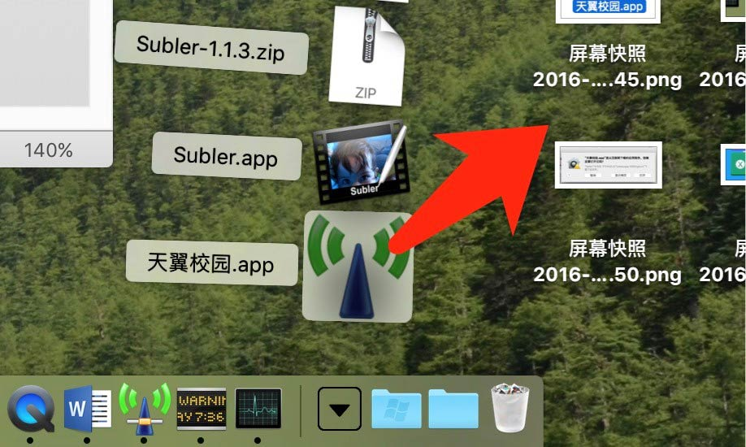

## 电信电脑端设置上网(macOS)

### 安装

1. 打开下载页面，点击下载mac版本

2. 在dock右边找到下载并点击

3. 找到客户端图标并拖拽到桌面

4. 在屏幕左上角点击apple标志打开菜单，打开 系统偏好设置

5. 打开 安全性与隐私

6. 在窗口左下角点击小锁头图标

7. 输入用户密码解锁

8. 勾选任何来源(稍后会更改为较为安全的选项)，并且允许

9. 在桌面找到执行程序双击运行

10. 在弹出的安全提示点击打开

11. 回到设置勾选原来的Mac App Store 和被认可的开发者选项，并点击左下角小锁头防止更改

12. 填写账号密码并登陆

### 安装过程常见问题

- 出现非校园客户端网络认证环境

  解决方案：

  - 拥有以太网转USB或雷电转换器
  
    1. 打开系统设置，选择网络
    
    
    
    2. 在左方选择以太网
    
    
    
    3. 如果 配置ipv4 出现手动选项，则调回DHCP
    
    
    
    4. 点击应用
    
    
    
    5. 等待出现正确的IP(172开头)
    
    
    
    6. 如果没有找到对应以太网选项
    
    7. 按住option√键，点击屏幕左上角apple图标并进入系统信息
    
    8. 在左侧列表选择usb，看一看设备中有没有usb网卡（无法编写雷电接口教程，应该相似） 
    
    
    
    9. 如果没有的话：
    
      - 网卡坏了
      
      - 买到了不是免驱的网卡，照说明书下载驱动
      
    10. 有的话，回到设置，点击
    
    
    
    11. 选择接口列表选择usb以太网，并点击创建
    
    
    
    12. 点击应用
    
    
    
    13. 等几秒
    
    
    
    14. 之后再试试连接吧
    
  - 没有以太网转USB或雷电转换器
  
    1. 点击右上角wifi图标连接FYoung
    
    
    
    2. 之后正常进行客户端连接
    
    3. 如果搜索不到那个，那就买一个吧！
    
    
[上一条：电信电脑端设置上网(Windows)](/guide/setWindowsDX)

[下一条：移动及联通电脑端上网前的准备](/guide/preparePPPoE)
    